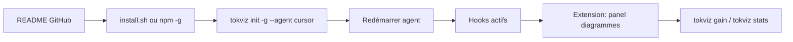
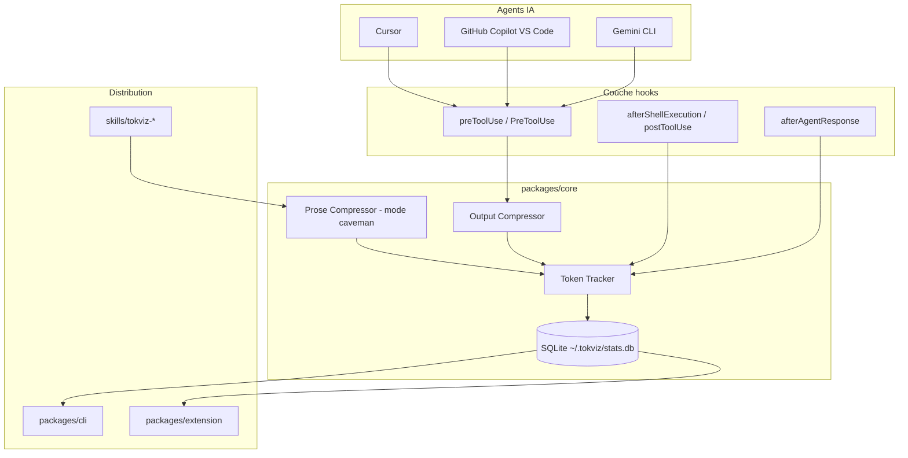
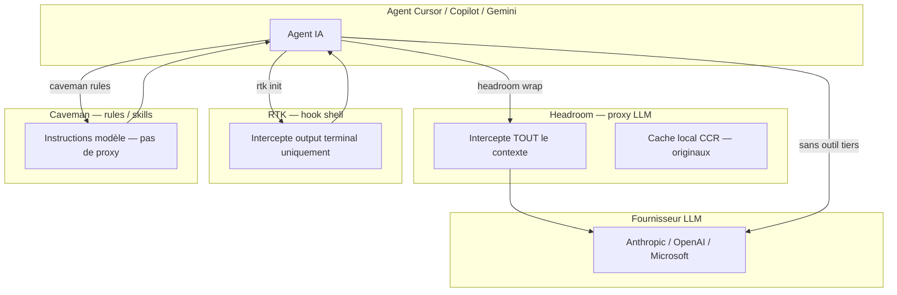

# Spécification — TokViz

**Projet personnel** — package open-source de réduction et visualisation de consommation de tokens pour agents IA (Cursor, GitHub Copilot, Gemini CLI).

**Créé** : 2026-06-05  
**Statut** : Draft  
**Emplacement** : `/Users/zahramaaziz/Desktop/tok-viz/` (repo local — publication GitHub à faire)

---

## 1. Résumé exécutif

TokViz est un outil unifié inspiré de **[RTK](https://github.com/rtk-ai/rtk)** (Rust Token Killer) et **[Caveman](https://github.com/JuliusBrussee/caveman)** :

| Source | Ce qu'on reprend |
|--------|------------------|
| **RTK** | Compression output shell via hooks, CLI `init`, SQLite analytics, extension Inspector |
| **Caveman** | Compression prose (réponses modèle), skills slash commands, rules multi-éditeur |
| **TokViz (nouveau)** | Dashboard unifié avec diagrammes, stats cross-agent, install GitHub one-liner |

**Proposition de valeur** : un seul package installable (`tokviz init -g --agent cursor`) qui réduit les tokens **et** les visualise en temps réel — shell + prose + par outil.

---

## 2. Contexte et problème

### 2.1 Problème utilisateur

Les développeurs qui utilisent Cursor, Copilot ou Gemini CLI consomment rapidement leur quota de tokens / requêtes premium parce que :

1. Les outputs terminal (`git diff`, `cargo test`, `grep`) sont verbeux et remplissent le contexte.
2. Les réponses du modèle contiennent du remplissage (articles, hedging, politesse).
3. Aucun outil ne combine **compression active** + **visualisation claire** des économies sur tous les agents.

### 2.2 Solutions existantes

| Outil | Cible | Mécanisme | Visualisation | Agents |
|-------|-------|-----------|---------------|--------|
| RTK | Output shell | Proxy Rust, hooks `preToolUse` | `rtk gain` CLI + extension RTK Inspector | 14 agents |
| Caveman | Prose assistant | Skills + rules caveman | `/caveman-stats` (texte, hook JSONL) | Cursor, Windsurf, Cline, Claude Code |
| TokViz | Shell **+** prose | Core TS/Rust + hooks + skills | Webview diagrammes + CLI + status bar | Cursor, Copilot, Gemini (MVP) |

### 2.3 Positionnement TokViz

```
                    Compression shell          Compression prose          Diagrammes
RTK                      ████████████████████         ░░░░░░░░░░░░░░         ████████░░░░
Caveman                  ░░░░░░░░░░░░░░░░░░░░         ████████████████         ████░░░░░░░░
TokViz                   ████████████████████         ████████████████         ████████████████████
```

---

## 3. Vision produit

### 3.1 Nom de code

**TokViz** (Token Visualizer) — nom provisoire, à valider avant publication npm/GitHub.

Alternatives : `ctxsave`, `tokenscope`, `flowtokens`.

### 3.2 Utilisateur cible

- Développeur solo ou équipe utilisant Cursor / Copilot / Gemini CLI au quotidien.
- Sensibilisé aux coûts tokens (quotas Copilot Pro+, crédits Claude, context window 200K).
- Veut installer en une commande, sans changer son workflow.

### 3.3 Parcours utilisateur cible



1. Découverte via GitHub / README / gif demo dashboard.
2. Install : `npm install -g @tokviz/cli` ou `curl -fsSL …/install.sh | bash`.
3. Setup : `tokviz init -g --agent cursor` (ou `--copilot`, `--gemini`).
4. Usage transparent — commandes shell et réponses modèle optimisées automatiquement.
5. Consultation stats : extension webview + CLI + status bar.

---

## 4. Architecture technique

### 4.1 Vue d'ensemble



### 4.2 Structure monorepo (repo GitHub dédié)

```text
tokviz/
├── README.md
├── LICENSE                    # Proprietary (commercial interdit sans accord)
├── install.sh                 # one-liner curl | bash
├── package.json               # workspaces pnpm/npm
├── packages/
│   ├── core/                  # tracker, compressor, storage
│   │   ├── src/
│   │   │   ├── tracker.ts
│   │   │   ├── compressor/
│   │   │   │   ├── git.ts
│   │   │   │   ├── grep.ts
│   │   │   │   └── generic.ts
│   │   │   ├── prose/
│   │   │   │   └── caveman-lite.ts
│   │   │   └── db.ts          # SQLite
│   │   └── package.json
│   ├── cli/                   # binaire tokviz
│   │   ├── src/
│   │   │   ├── commands/
│   │   │   │   ├── init.ts
│   │   │   │   ├── gain.ts
│   │   │   │   └── stats.ts
│   │   │   └── index.ts
│   │   └── package.json
│   └── extension/             # VS Code / Cursor
│       ├── src/
│       │   ├── extension.ts
│       │   └── webview/
│       │       ├── Dashboard.tsx
│       │       └── charts/
│       ├── package.json
│       └── README.md
├── hooks/
│   ├── cursor/
│   │   ├── hook.sh
│   │   └── README.md
│   ├── copilot/
│   │   └── hook.js
│   ├── gemini/
│   │   └── hook.js
│   └── shared/
│       └── rewrite.ts         # logique commune appelée par hooks
├── skills/
│   ├── tokviz-compress/       # mode prose (inspiré caveman)
│   │   └── SKILL.md
│   └── tokviz-stats/
│       └── SKILL.md
├── rules/
│   ├── cursor/
│   │   └── tokviz.mdc
│   └── windsurf/
│       └── tokviz.md
└── .github/
    └── workflows/
        ├── ci.yml
        └── release.yml
```

### 4.3 Choix technologiques

| Composant | Choix recommandé | Alternative | Justification |
|-----------|------------------|-------------|---------------|
| Core + CLI | **TypeScript / Node 20+** | Rust (comme RTK) | Partage code avec extension VS Code, dev plus rapide MVP |
| Storage | **SQLite** (`better-sqlite3`) | JSONL | Aligné RTK, requêtes analytics faciles |
| Extension | **VS Code Extension API** + React webview | Standalone Electron | Cursor = fork VS Code, Copilot même marketplace |
| Charts | **Recharts** ou Chart.js | D3 | Suffisant pour line/bar/pie charts |
| Hooks Cursor | Shell script → appelle `tokviz hook` | Rust binaire | Pattern RTK validé |
| Package manager | **pnpm workspaces** | npm workspaces | Monorepo propre |

> **Note** : migration Rust possible en v2 pour perf compression shell si besoin.

---

## 5. Fonctionnalités détaillées

### 5.1 Core — Token Tracker

Enregistre chaque événement tokenisable :

```typescript
interface TokenEvent {
  id: string;
  sessionId: string;
  agent: 'cursor' | 'copilot' | 'gemini' | 'claude-code' | 'windsurf';
  timestamp: string;           // ISO 8601
  source: 'shell' | 'prose' | 'tool' | 'subagent';
  toolName?: string;           // Shell, Grep, Read, etc.
  command?: string;            // git diff, cargo test, …
  tokensRaw: number;           // estimation ou compteur réel
  tokensOptimized: number;
  tokensSaved: number;         // raw - optimized
  metadata?: Record<string, unknown>;
}

interface SessionStats {
  sessionId: string;
  agent: string;
  startedAt: string;
  tokensIn: number;
  tokensOut: number;
  tokensSaved: number;
  savingsPercent: number;
  byTool: Record<string, { in: number; out: number; saved: number }>;
  bySource: Record<string, number>;
  timeline: { ts: string; cumulativeSaved: number }[];
}
```

**Estimation tokens** (MVP) : `Math.ceil(text.length / 4)` (heuristique GPT).  
**V2** : lecture JSONL session Claude Code / API usage si exposée.

**Rétention** : 90 jours (aligné RTK), configurable.

### 5.2 Core — Shell Compressor

Inspiré RTK. Filtres par commande :

| Commande | Stratégie compression |
|----------|----------------------|
| `git status` | lignes pertinentes, skip untracked massifs |
| `git diff` | hunks condensés, limite lignes |
| `git log` | `--oneline`, N commits max |
| `grep` / `rg` | group by file, cap matches |
| `cargo test` / `pytest` | errors only, stats summary |
| `ls` / `find` | structure tree condensée |
| `docker ps` / `kubectl get` | colonnes essentielles |
| Inconnu | pass-through + track quand même |

**Fail-safe** : si compression échoue → output brut (CI/CD safe). Exit code préservé.

### 5.3 Core — Prose Compressor (mode Caveman)

Inspiré Caveman. Niveaux :

| Niveau | Trigger | Effet |
|--------|---------|-------|
| `off` | défaut | pas de compression prose |
| `lite` | `/tokviz lite` | drop filler, garde structure |
| `full` | `/tokviz` | caveman classique |
| `ultra` | `/tokviz ultra` | compression max |

Implémentation MVP : **skill + rules** (le modèle suit instructions).  
V2 : post-processing hook `afterAgentResponse` pour mesurer savings réels.

### 5.4 CLI — Commandes

```bash
# Installation hooks globaux
tokviz init -g --agent cursor
tokviz init -g --agent copilot
tokviz init -g --agent gemini
tokviz init -g --agent cursor --prose full   # + skill caveman

# Stats
tokviz gain              # résumé session / total (comme rtk gain)
tokviz stats             # détail par tool, par jour
tokviz stats --json      # export pour scripts
tokviz stats --session   # session courante uniquement

# Debug
tokviz hook              # appelé par hooks agents (stdin JSON → stdout JSON)
tokviz doctor            # vérifie hooks installés, DB, extension

# Désinstall
tokviz uninstall -g --agent cursor
```

### 5.5 Hooks multi-agents

| Agent | Event hook | Format réponse | Réécrit commande ? |
|-------|------------|----------------|-------------------|
| **Cursor** | `preToolUse`, `afterShellExecution`, `afterAgentResponse` | `updated_input` | Oui (preToolUse) |
| **Copilot VS Code** | `PreToolUse` | `updatedInput` | Oui |
| **Copilot CLI** | `PreToolUse` | deny-with-suggestion | Non (retry agent) |
| **Gemini CLI** | `BeforeTool` | `hookSpecificOutput` | Oui |
| **Claude Code** | `PreToolUse` | shell hook | Oui (P2) |
| **Windsurf / Cline** | rules file | prompt-level | N/A (P3) |

**`tokviz init` doit être idempotent** : merge `hooks.json` sans écraser hooks existants (RTK + TokViz cohabitation possible).

### 5.6 Extension VS Code / Cursor

**ID extension** : `tokviz.tokviz-inspector`

**Contributions** :

| Feature | Description |
|---------|-------------|
| **Sidebar panel** | Dashboard webview avec diagrammes |
| **Status bar** | `TokViz: 12.4k saved (34%)` — clic ouvre panel |
| **Command palette** | `TokViz: Open Dashboard`, `TokViz: Refresh Stats` |
| **Auto-refresh** | poll DB toutes les 5s en session active |

**Diagrammes (webview React)** :

1. **Line chart** — tokens cumulés / économisés dans le temps (session).
2. **Bar chart** — économies par type : shell vs prose vs tool.
3. **Pie chart** — répartition consommation par tool (`Shell`, `Read`, `Grep`, `Write`, …).
4. **Table** — top 10 commandes les plus coûteuses + savings après compression.

**Publication** :
- [VS Code Marketplace](https://marketplace.visualstudio.com/)
- [Open VSX](https://open-vsx.org/) (Cursor, VSCodium)

---

## 6. Distribution GitHub (comme RTK et Caveman)

### 6.1 Modèles de distribution comparés

| | RTK | Caveman | TokViz |
|---|-----|---------|--------|
| Install CLI | binaire Rust + install.sh | skills copy / marketplace skill | npm global + install.sh |
| Setup | `rtk init -g --agent X` | copie `.agents/skills/`, rules | `tokviz init -g --agent X` |
| Extension | RTK Inspector | — | TokViz Inspector |
| Releases | GitHub Releases binaires | tags git | npm + GitHub Releases |
| Docs | rtk-ai.app/docs | README GitHub | README + `/docs` |

### 6.2 README GitHub (sections obligatoires)

1. Badges : build, npm version, license Proprietary, downloads.
2. GIF demo dashboard (15s).
3. One-liner install.
4. Tableau agents supportés + statut (✅ / 🚧 / 📋).
5. Quick start 3 étapes.
6. `tokviz gain` exemple output.
7. Comparison vs RTK / Caveman (honest, avec liens).
8. Contributing + License.

### 6.3 Install one-liner

```bash
# npm (recommandé)
npm install -g @tokviz/cli
tokviz init -g --agent cursor

# ou script shell
curl -fsSL https://raw.githubusercontent.com/<org>/tokviz/main/install.sh | bash
tokviz init -g --agent cursor
```

### 6.4 CI/CD Release

```yaml
# .github/workflows/release.yml (résumé)
on:
  push:
    tags: ['v*']
jobs:
  release:
    - test (macOS, ubuntu, windows)
    - build cli
    - npm publish @tokviz/cli
    - npm publish @tokviz/core
    - vsce publish extension (token VSCE_PAT)
    - GitHub Release + changelog
```

---

## 7. User stories et priorités

### US-1 — Install Cursor + tracking passif (P1)

**En tant que** dev Cursor, **je veux** installer TokViz en une commande **afin de** voir ma consommation tokens sans changer mon workflow.

**Test indépendant** : `tokviz init -g --agent cursor` → hook `afterAgentResponse` enregistre events → `tokviz stats` affiche total.

**Scénarios** :

1. **Given** Cursor installé, **When** `tokviz init -g --agent cursor`, **Then** `~/.cursor/hooks.json` contient hooks TokViz sans écraser existants.
2. **Given** session agent active, **When** agent répond, **Then** event enregistré en DB avec estimation tokens.
3. **Given** DB populated, **When** `tokviz stats`, **Then** affiche total in/out/saved.

---

### US-2 — Compression shell (P1)

**En tant que** dev, **je veux** que les outputs `git diff`, `grep`, tests soient compressés **afin de** réduire le contexte sans action manuelle.

**Test indépendant** : hook `preToolUse` réécrit `git status` → output < 30% taille original, exit code identique.

**Scénarios** :

1. **Given** hook actif, **When** agent lance `git diff`, **Then** commande réécrite en `tokviz git diff` (ou filtrage post-exec).
2. **Given** compression échoue, **When** commande exécutée, **Then** output brut retourné, exit code préservé.
3. **Given** commande inconnue, **When** exécutée, **Then** pass-through + tracked.

---

### US-3 — Dashboard diagrammes extension (P1)

**En tant que** dev, **je veux** un panel visuel avec courbes **afin de** comprendre où partent mes tokens.

**Test indépendant** : installer extension → ouvrir panel → voir line chart + bar chart avec données session.

**Scénarios** :

1. **Given** extension installée + DB avec events, **When** `TokViz: Open Dashboard`, **Then** webview affiche 3 graphiques.
2. **Given** session en cours, **When** nouvel event, **Then** charts refresh ≤ 5s.
3. **Given** status bar, **When** clic, **Then** ouvre dashboard.

---

### US-4 — Support Copilot + Gemini (P2)

**En tant que** dev multi-outils, **je veux** le même setup pour Copilot et Gemini CLI.

**Test** : `tokviz init -g --agent copilot` et `--gemini` installent hooks respectifs.

---

### US-5 — Mode prose Caveman (P2)

**En tant que** dev, **je veux** activer compression prose **afin de** réduire tokens réponses assistant.

**Test** : `/tokviz full` active skill → réponses plus courtes → `tokensSaved` prose > 0 dans stats.

---

### US-6 — CLI `tokviz gain` (P2)

**En tant que** dev terminal-first, **je veux** `tokviz gain` **afin de** voir économies sans ouvrir extension.

**Exemple output** :

```text
TokViz — Token Savings
──────────────────────
Session:  cur-abc123 (cursor)
Duration: 47 min
Raw:      142,800 tokens
Optimized: 89,200 tokens
Saved:     53,600 tokens (37.5%)

Top savings:
  git diff     -18,400 (71%)
  cargo test   -12,100 (82%)
  prose mode   -8,900  (41%)
```

---

### US-7 — Coexistence RTK / Caveman (P3)

**En tant que** dev avec RTK ou Caveman déjà installés, **je veux** que TokViz ne casse rien.

**Test** : RTK + TokViz hooks merge OK ; stats TokViz trackent même si RTK compresse déjà.

---

## 8. Roadmap MVP

### Phase 0 — Spec & repo (semaine 0)

- [x] Spec initiale (`SPEC-tokviz-package.md`)
- [x] Scaffold monorepo local (`packages/core`, `packages/cli`, hooks, skills)
- [ ] Créer repo GitHub public `tokviz`
- [ ] Choisir nom final + org npm `@tokviz`
- [x] LICENSE Proprietary + README skeleton

### Phase 1 — Core + Cursor (semaines 1–2)

- [ ] `packages/core` : tracker + SQLite
- [ ] `packages/cli` : `init`, `stats`, `hook`
- [ ] Hook Cursor : `afterAgentResponse` + `afterShellExecution` (tracking)
- [ ] Hook Cursor : `preToolUse` (compression shell basique : git, grep)
- [ ] Tests unitaires compressor

### Phase 2 — Extension diagrammes (semaine 3)

- [ ] Extension VS Code : webview React + Recharts
- [ ] Line / bar / pie charts
- [ ] Status bar item
- [ ] Publish Open VSX (beta)

### Phase 3 — Multi-agent + prose (semaines 4–5)

- [ ] Hooks Copilot + Gemini CLI
- [ ] Skills tokviz-compress (mode caveman)
- [ ] `tokviz gain` formaté
- [ ] `install.sh` + npm publish `@tokviz/cli`

### Phase 4 — Polish (semaine 6+)

- [ ] GIF demo README
- [ ] Docs site (optionnel : rtk-ai.app style)
- [ ] VS Code Marketplace
- [ ] `tokviz doctor`, `uninstall`
- [ ] Windows support test

---

## 9. Modèle de données SQLite

```sql
CREATE TABLE sessions (
  id          TEXT PRIMARY KEY,
  agent       TEXT NOT NULL,
  started_at  TEXT NOT NULL,
  ended_at    TEXT,
  project_path TEXT
);

CREATE TABLE events (
  id               TEXT PRIMARY KEY,
  session_id       TEXT NOT NULL REFERENCES sessions(id),
  timestamp        TEXT NOT NULL,
  source           TEXT NOT NULL,  -- shell | prose | tool | subagent
  tool_name        TEXT,
  command          TEXT,
  tokens_raw       INTEGER NOT NULL,
  tokens_optimized INTEGER NOT NULL,
  tokens_saved     INTEGER NOT NULL,
  metadata_json    TEXT
);

CREATE INDEX idx_events_session ON events(session_id);
CREATE INDEX idx_events_timestamp ON events(timestamp);
CREATE INDEX idx_events_source ON events(source);

-- rétention : purge events > 90 jours (job CLI ou cron)
```

---

## 10. Sécurité, confidentialité et données entreprise

> **Contexte** : remarque collègue lors de l'exploration RTK / Caveman / Headroom — *« Headroom verrait passer toutes nos données »*. Cette section documente l'analyse pour les revues sécu / EV et fixe les contraintes de conception TokViz.

### 10.1 Qui voit quoi ? (comparatif outils existants)



| Outil | Données interceptées | Envoi vers serveur tiers ? | Surface de risque |
|-------|---------------------|----------------------------|-------------------|
| **[Headroom](https://github.com/chopratejas/headroom)** | **Tout** : tool outputs, fichiers lus, logs, historique, RAG | OSS : non (local). App [extraheadroom.com](https://extraheadroom.com/privacy) : stats + Sentry / Aptabase / Clarity | **Élevée** — proxy central sur tout le contexte |
| **[RTK](https://github.com/rtk-ai/rtk)** | **Shell seulement** : `git diff`, tests, `grep`, etc. | Non revendiqué (local, SQLite, pas de télémétrie) | **Moyenne** — voit output commandes |
| **[Caveman](https://github.com/JuliusBrussee/caveman)** | **Rien** techniquement — change le style des réponses | Non | **Faible** — fichiers markdown locaux |
| **TokViz (cible)** | Shell + métriques prose (pas proxy LLM) | **Non par défaut** — local-only | **Moyenne-faible** — modèle RTK + Caveman, sans proxy global |

**Point clé** : « local » ≠ « ne voit rien ». Headroom et RTK traitent des données sensibles **sur le poste**. Le fournisseur LLM (via Cursor/Copilot) voit déjà le code — ces outils ajoutent une **couche locale supplémentaire**.

Headroom embarque d'ailleurs RTK pour la compression shell — utiliser Headroom implique RTK dans la chaîne, plus une interception bien plus large.

### 10.2 Analyse Headroom (remarque collègue validée)

Avec `headroom wrap cursor` ou `headroom proxy`, **tout le contexte agent** transite par le process Headroom, même sans cloud.

**Risques identifiés** :

| # | Risque | Détail |
|---|--------|--------|
| 1 | Vision globale du contexte | Code, secrets dans diffs, `.env`, schémas DB, credentials dans output shell |
| 2 | Stockage local CCR | Originaux conservés sur disque pour `headroom_retrieve` |
| 3 | Supply chain | `pip install headroom-ai` / `npm install headroom-ai` — confiance package + dépendances |
| 4 | Version commerciale | Sync stats serveur ; Sentry peut inclure du code dans crash dumps |
| 5 | OpenTelemetry | Export métriques vers endpoint configurable |

**Conclusion EV** : Headroom **non recommandé** sur projets sensibles (DCM, infra, credentials) sans validation RSSI / DPO explicite.

### 10.3 RTK et Caveman — nuance

**RTK** — acceptable uniquement si :
- revue code open source effectuée ;
- pas de secrets dans le repo (`.env` gitignored, pas de credentials en clair) ;
- politique interne autorise outils dev locaux non audités.

**Caveman** — risque data faible ; le modèle parle plus court, pas de pipeline d'interception.

### 10.4 Contexte projet DCM / entreprise

| Question | Headroom | RTK | Caveman | TokViz |
|----------|----------|-----|---------|--------|
| Données quittent le poste vers serveur de l'outil ? | Non (OSS) / partiel (app commerciale) | Non | Non | **Non (by design)** |
| Tiers local voit code / confidentiel ? | **Oui, tout** | **Oui, output shell** | Non | Shell + métriques seulement |
| Stockage local sensible ? | Cache CCR complet | SQLite stats | JSONL stats | SQLite métriques |
| Review sécu nécessaire ? | **Oui, forte** | **Oui, modérée** | Faible | **Oui, modérée** |
| Compatible politique « no third-party on code » ? | **Probablement non** | **À valider** | **Probablement oui** | **À valider — mode enterprise** |

### 10.5 Principes de conception TokViz (enterprise-safe)

Contraintes **obligatoires** pour passage EV / déploiement sur code sensible :

| Principe | Implémentation |
|----------|----------------|
| **Pas de proxy LLM** | Ne jamais intercepter l'ensemble du contexte (contrairement à Headroom). Hooks ciblés uniquement. |
| **Modèle RTK, pas Headroom** | Compression shell via `preToolUse` / `afterShellExecution` — pas de `wrap` global. |
| **Modèle Caveman pour prose** | Rules / skills — pas de post-traitement serveur des réponses. |
| **Local-only par défaut** | Zéro télémétrie cloud ; pas de compte ; pas de sync stats serveur. |
| **`--no-content-log`** | DB stocke hash + compteurs tokens, pas le contenu des commandes. |
| **`--track-only`** | Mode passif : stats sans compression — pour environnements très restrictifs. |
| **Fail-open** | Erreur hook = laisser passer ; jamais bloquer l'agent. |
| **Filtre secrets** | Regex `API_KEY`, `password=`, patterns custom avant toute persistance. |
| **Rétention limitée** | Purge auto 90 jours ; option `--retention-days 0` (session only). |
| **Open source auditable** | Code public, build reproductible, pas de binaire opaque obligatoire. |
| **README « Non affilié »** | Cursor, Copilot, Gemini = marques tierces ; TokViz non endorsed. |

### 10.6 Mitigations techniques TokViz

| Risque | Mitigation |
|--------|------------|
| Contenu commandes en DB | `--no-content-log` par défaut en mode `enterprise` ; hash + metrics seulement |
| Hooks fail → bloquent agent | Fail-open : erreur hook = laisser passer |
| Secrets dans output shell | Filtre regex avant persist ; deny-list chemins (`.env`, `*credentials*`) |
| DB locale | `~/.tokviz/` — jamais envoyé cloud ; chiffrement optionnel at-rest (v2) |
| Extension permissions | Lecture seule `~/.tokviz/stats.db` ; pas d'accès réseau |
| Coexistence RTK / Headroom | `tokviz doctor` détecte proxies concurrents ; warning si Headroom actif |

### 10.7 Checklist revue sécu (avant install équipe)

- [ ] Outil évalué : Headroom / RTK / Caveman / TokViz ?
- [ ] Proxy global LLM ? (si oui → escalade RSSI)
- [ ] Données stockées localement ? Contenu ou métriques seulement ?
- [ ] Télémétrie / cloud sync ? Opt-in ou opt-out ?
- [x] Code source auditable (repo public, licence propriétaire) ?
- [ ] Secrets / `.env` / schémas prod exclus du contexte agent ?
- [ ] Politique Cursor / Copilot entreprise déjà validée (LLM provider) ?

### 10.8 Décision produit — ce que TokViz ne fera pas

Pour rester aligné EV :

1. **Pas de mode proxy** type `tokviz wrap cursor` sur contexte complet.
2. **Pas de cache réversible** de tout le contexte (pas de CCR global).
3. **Pas de télémétrie cloud** obligatoire — jamais.
4. **Pas d'embarquement** de Headroom ou équivalent proxy dans le package.

---

## 11. Aspects légaux et crédits

- **License** : Proprietary © Zahra Maaziz — usage perso OK, commercial interdit sans accord écrit (différent de RTK/Caveman qui sont MIT).
- **Inspiration** : architecture et UX inspirées de RTK et Caveman — **pas de copie de code** sans vérifier LICENSE source.
- **Attribution README** :

  > Inspired by [RTK](https://github.com/rtk-ai/rtk) (shell compression) and [Caveman](https://github.com/JuliusBrussee/caveman) (prose compression).

- **Branding** : nom distinct, logo propre — pas "rtk2" ni "caveman-plus".
- **Marques** : Cursor, GitHub Copilot, Gemini = marques déposées de leurs éditeurs ; mention "non affilié" dans README.

---

## 12. Métriques de succès

| Métrique | Cible MVP | Cible v1 |
|----------|-----------|----------|
| Réduction tokens shell | ≥ 40% median | ≥ 60% (aligné RTK) |
| Réduction tokens prose (mode full) | ≥ 30% | ≥ 50% (aligné Caveman) |
| Install → first stats | < 5 min | < 2 min |
| npm downloads / mois | 100 | 1000 |
| GitHub stars | 50 | 500 |
| Crash rate hooks | 0% block agent | 0% |

---

## 13. Questions ouvertes

| # | Question | Options | Décision |
|---|----------|---------|----------|
| 1 | Nom final | TokViz / ctxsave / autre | ⏳ À décider |
| 2 | Langage core | TypeScript vs Rust | TS pour MVP |
| 3 | Repo | GitHub org perso vs org équipe | ⏳ |
| 4 | Estimation vs tokens réels | heuristique /4 vs JSONL | heuristique MVP |
| 5 | Extension seule possible ? | oui (passive tracker) | oui, mode `--track-only` |
| 6 | Intégrer dans dataint-dcm-app ? | non — repo séparé | repo séparé recommandé |
| 7 | Mode enterprise par défaut ? | oui `--no-content-log` | ⏳ valider EV |
| 8 | Proxy type Headroom ? | non — hors scope | **non, exclu** |

---

## 14. Références

- RTK : https://github.com/rtk-ai/rtk — docs https://www.rtk-ai.app/docs
- Caveman : https://github.com/JuliusBrussee/caveman
- Headroom : https://github.com/chopratejas/headroom — privacy app https://extraheadroom.com/privacy
- Cursor Hooks : `.cursor/hooks.json` — voir skill `create-hook` interne
- RTK hooks README : https://github.com/rtk-ai/rtk/blob/develop/hooks/README.md
- Caveman skills (local) : `dataint-dcm-app/.agents/skills/caveman*/`

---

## 15. Prochaine action

1. Valider nom **TokViz** (ou alternative).
2. Créer repo GitHub vide + scaffold monorepo (`pnpm init`, packages/core, packages/cli).
3. Implémenter US-1 (Cursor tracking passif) comme premier PR.

---

*Document rédigé dans le cadre du projet perso Zahra — spec initiale avant création repo dédié.*
