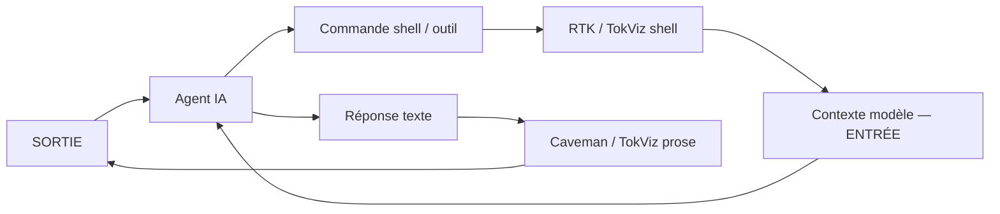

# TokViz — Présentation équipe

**Auteur :** Zahra Maaziz  
**Version :** 2026-06-05  
**Public :** équipes dev utilisant Cursor, GitHub Copilot, Gemini CLI  
**Durée présentation suggérée :** 15–20 min + 10 min démo

---

## 1. En une phrase

**TokViz** réduit et **mesure** la consommation de tokens des agents IA — compression shell + prose, **100 % local**, sans compte cloud.

> Inspiré de [RTK](https://github.com/rtk-ai/rtk) et [Caveman](https://github.com/JuliusBrussee/caveman). Projet indépendant, non affilié.

---

## 2. Le problème

Quand on code avec un agent IA (Copilot, Cursor, Gemini CLI), on brûle du quota vite parce que :

| Source de gaspillage | Exemple | Impact |
|---------------------|---------|--------|
| **Sorties terminal verbeuses** | `git diff`, `pytest`, `grep -r` | Remplit le **contexte** (tokens **entrée**) |
| **Réponses modèle bavardes** | « Sure! I'd be happy to help… » | Tokens **sortie** inutiles |
| **Aucune visibilité** | Quota Copilot / crédits Claude | Impossible de **comparer** sessions ou outils |

**Ce que TokViz ne fait pas :** il ne nettoie pas le prompt que *vous* tapez. Il agit sur le bruit **autour** — résultats outils + réponses agent.

---

## 3. Paysage : RTK, Caveman, TokViz

### 3.1 Deux flux complémentaires



| Outil | Cible | Flux | Mécanisme | Visualisation |
|-------|-------|------|-----------|---------------|
| **RTK** | Sortie shell | Entrée | Proxy Rust, hooks Bash | `rtk gain` CLI |
| **Caveman** | Prose agent | Sortie | Skills / rules | `/caveman-stats` (Claude Code) |
| **TokViz** | Shell **+** prose | Entrée **+** sortie | Hooks TS + skills | `tokviz gain`, `tokviz stats`, **rapports** |

**Message clé pour l'équipe :** RTK et Caveman ne sont pas des concurrents — ils couvrent des tuyaux différents. TokViz **unifie** les deux et ajoute ce qui manque : **mesure, rapports, comparaison de sessions**.

### 3.2 Matrice positionnement

```
                    Compression shell    Compression prose    Stats / rapports
RTK                      ████████████           ░░░░                ████░░░░
Caveman                  ░░░░░░░░░░░░           ████████████        ██░░░░░░
TokViz                   ████████████           ████████████        ████████████
```

---

## 4. Ce que fait TokViz aujourd'hui (MVP)

### 4.1 Fonctionnalités

1. **Tracking local** — chaque événement tokenisable → `~/.tokviz/events.json`
2. **Compression shell** — `git diff`, tests, grep… compressés avant injection dans le contexte agent
3. **Mode prose optionnel** — skills `/tokviz lite|full|ultra` (style Caveman)
4. **CLI stats** — résumé global et par session

### 4.2 Agents supportés

| Agent | Statut | Installation |
|-------|--------|--------------|
| Cursor | ✅ MVP | `tokviz init -g --agent cursor` |
| GitHub Copilot (VS Code) | ✅ MVP | `tokviz init -g --agent copilot` |
| Gemini CLI | ⚠️ Sunset **18 juin 2026** (free/Pro/Ultra) | `tokviz init -g --agent gemini` |
| **Antigravity CLI** (`agy`) | 🚧 À ajouter (remplace Gemini) | `tokviz init -g --agent antigravity` (planifié) |
| Extension VS Code (graphiques) | 🚧 Planifié | — |

> **Phase actuelle :** validation **Cursor seulement** → [CURSOR-TEST-CHECKLIST.md](./CURSOR-TEST-CHECKLIST.md). Multi-agent (Copilot / Antigravity) = plus tard.

### 4.3 Commandes disponibles

```bash
tokviz init -g --agent copilot     # installer hooks
tokviz gain                        # résumé économies globales
tokviz stats                       # détail + 5 dernières sessions
tokviz stats --json                # export machine (CI, scripts)
tokviz stats --session <id>        # une session
tokviz doctor                      # vérifier installation
```

### 4.4 Exemple `tokviz gain`

```text
TokViz — Token Savings
────────────────────────────────────────
Raw:       142,800 tokens
Optimized: 89,200 tokens
Saved:     53,600 tokens (37.5%)

Top savings:
  git diff         -18,400 (71%)
  cargo test       -12,100 (82%)
```

---

## 5. Rapports — oui, c'est prévu (et partiellement là)

### 5.1 Rapport global (existant)

**Commande :** `tokviz gain`  
**Usage équipe :** partager en stand-up ou retro — « combien on a économisé cette semaine ».

### 5.2 Rapport détaillé (existant)

**Commande :** `tokviz stats --json > rapport-$(date +%F).json`  
**Contenu :**

```json
{
  "global": {
    "totalRaw": 142800,
    "totalOptimized": 89200,
    "totalSaved": 53600,
    "savingsPercent": 37.5,
    "eventCount": 412,
    "sessions": 18
  },
  "sessions": [
    {
      "sessionId": "abc-123",
      "agent": "copilot",
      "tokensIn": 12400,
      "tokensOut": 8100,
      "tokensSaved": 4300,
      "savingsPercent": 34.7,
      "byTool": { "Shell": { "in": 8000, "out": 4200, "saved": 3800 } },
      "bySource": { "shell": 8000, "prose": 4400 },
      "timeline": [{ "ts": "2026-06-05T10:00:00Z", "cumulativeSaved": 1200 }]
    }
  ]
}
```

### 5.3 Rapport équipe (à venir — V1.1)

**Commande proposée :**

```bash
tokviz report                    # rapport Markdown terminal
tokviz report --format md -o rapport-semaine-24.md
tokviz report --format html    # pour partage Confluence / Teams
tokviz report --since 7d       # fenêtre glissante
tokviz report --agent copilot  # filtre par outil
```

**Structure du rapport Markdown :**

```markdown
# TokViz — Rapport tokens (2026-06-01 → 2026-06-07)

## Synthèse
| Métrique | Valeur |
|----------|--------|
| Sessions | 24 |
| Tokens bruts | 312 400 |
| Tokens optimisés | 198 100 |
| Économie | 114 300 (36,6 %) |

## Top 5 commandes coûteuses
| Commande | Brut | Économie | % |
|----------|------|----------|---|
| git diff | 48 200 | 34 100 | 71 % |
| pytest | 22 400 | 18 300 | 82 % |

## Sessions les plus consommatrices
| Session | Agent | Tokens IN | Économie |
|---------|-------|-----------|----------|
| sess-8f2a | cursor | 42 100 | 12 % |
| sess-3c91 | copilot | 38 700 | 41 % |

## Recommandations
- Session `sess-8f2a` : 78 % du coût = `git diff` non compressé → vérifier hooks
- Comparer Cursor vs Copilot sur tâche identique (voir §6)
```

**Pourquoi un rapport ?** Les équipes ont besoin d'un artefact **partageable** (retro, challenge d'outils, justification budget Copilot Pro+). `gain` = snapshot ; `report` = document structuré.

---

## 6. Module comparaison de sessions (proposition V1.2)

### 6.1 Objectif

Permettre aux équipes de **challenger leurs outils** :

- « Ma session Cursor sur le refactor auth a consommé combien vs Copilot sur la même tâche ? »
- « Quelle session a le pire ratio économie / tokens bruts ? »
- « Quel agent gonfle le contexte avec du shell inutile ? »

### 6.2 Commandes proposées

```bash
# Comparer 2 sessions
tokviz compare sess-abc123 sess-def456

# Comparer par agent sur une période
tokviz compare --agents cursor,copilot --since 7d

# Classement sessions les plus coûteuses
tokviz compare --rank top --limit 10

# Export pour tableau équipe
tokviz compare --json -o compare-cursor-vs-copilot.json
```

### 6.3 Exemple sortie terminal

```text
TokViz — Session Compare
────────────────────────────────────────────────────────
Session A  sess-abc123  cursor   2026-06-03 14:22
Session B  sess-def456  copilot  2026-06-03 15:10

                    Session A      Session B      Delta
Tokens IN (brut)      42,100         38,700        +3,400  (+8.8%)
Tokens OUT (opt.)     37,000         22,800       +14,200  (+62%)
Économie TokViz        5,100         15,900       -10,800  (B gagne)
Taux économie           12.1%          41.1%       -29.0 pts

Par source:
  shell    A: 35,200 (84%)   B: 28,100 (73%)
  prose    A:  6,900 (16%)   B: 10,600 (27%)

Verdict: Session B (Copilot) consomme moins en sortie ET économise plus.
         Session A (Cursor) — vérifier si hooks TokViz actifs (économie 12 % faible).
```

### 6.4 Cas d'usage équipe

| Scénario | Commande | Décision possible |
|----------|----------|-------------------|
| Choisir Cursor vs Copilot pour reviews PR | `compare --agents cursor,copilot --since 30d` | Standardiser l'outil le plus efficient |
| Débugger une session anormale | `compare sess-X sess-Y` où Y = session médiane | Identifier commande ou tool fautif |
| Retro sprint | `report --since 14d` + `compare --rank top` | Partager bonnes pratiques |
| POC avant déploiement | `init --track-only` puis `compare` avant/après compression | Valider ROI TokViz |

### 6.5 Modèle de données (déjà en place)

Chaque événement enregistre :

| Champ | Rôle |
|-------|------|
| `sessionId` | Regroupe une session agent |
| `agent` | `cursor` \| `copilot` \| `gemini` |
| `source` | `shell` \| `prose` \| `tool` \| `subagent` |
| `tokensRaw` / `tokensOptimized` / `tokensSaved` | Mesure avant/après compression |
| `byTool` / `bySource` / `timeline` | Agrégats par session (déjà calculés) |

Le module **compare** = couche de présentation au-dessus de `getSessionStats()` — pas de refonte stockage.

---

## 7. Sécurité & entreprise

```bash
tokviz init -g --agent copilot --enterprise
```

| Garantie | Détail |
|----------|--------|
| **Local-first** | Données dans `~/.tokviz/` uniquement |
| **Pas de télémétrie** | Aucun envoi vers serveur TokViz |
| **Mode enterprise** | Métriques sans contenu de commande |
| **Fail-open** | Hooks ne bloquent jamais l'agent |
| **Rétention** | Purge auto 90 jours (configurable) |
| **Secrets** | Redaction avant stockage |

**Recommandation équipe :** valider avec la sécurité avant usage sur code entreprise ; utiliser `--enterprise` par défaut.

---

## 8. Installation rapide (démo live)

```bash
# 1. Install
git clone <repo-tokviz>
cd tokviz && pnpm install && pnpm build && pnpm link --global

# 2. Setup agent
tokviz init -g --agent copilot

# 3. Redémarrer VS Code

# 4. Travailler normalement 15 min (git, tests, chat agent)

# 5. Montrer les stats
tokviz gain
tokviz stats
tokviz stats --json | head -40
```

---

## 9. Script de présentation (15 min)

| Min | Slide / action | Message |
|-----|----------------|---------|
| 0–2 | Problème quotas | « On ne voit pas où partent les tokens » |
| 2–5 | RTK vs Caveman vs TokViz | « Complémentaires, TokViz unifie + mesure » |
| 5–8 | Démo `init` + session dev | Hooks transparents |
| 8–10 | `tokviz gain` | Chiffres concrets |
| 10–12 | Rapport JSON + roadmap `report` | Artefact partageable équipe |
| 12–15 | Module `compare` sessions | Challenger Cursor vs Copilot |
| 15–20 | Q&A sécurité + `--enterprise` | Adoption responsable |

---

## 10. Roadmap synthèse

| Version | Livrable | Statut |
|---------|----------|--------|
| **MVP** | Tracker + compressor shell + CLI gain/stats | ✅ Fait |
| **V1.1** | `tokviz report` (md/html, `--since`) | 🚧 À faire |
| **V1.2** | `tokviz compare` (sessions, agents, ranking) | 🚧 À faire |
| **V2** | Extension VS Code (graphiques, status bar) | 🚧 Planifié |
| **V2** | Lecture JSONL Claude Code (tokens réels API) | 🚧 Planifié |

---

## 11. FAQ équipe

**TokViz remplace RTK ou Caveman ?**  
Non. Même philosophie, package unifié + stats. RTK/Caveman peuvent coexister.

**Ça ralentit l'agent ?**  
Compression shell = quelques ms. Fail-open si erreur.

**Copilot VS Code : `/caveman-stats` marche ?**  
Non (hooks Claude Code). TokViz comble ce trou avec `gain` / `stats`.

**On peut comparer deux devs ?**  
Chaque machine = données locales. Comparaison = exporter JSON (`stats --json`) et fusionner, ou future option `--team-export` anonymisée.

**Usage commercial ?**  
Licence propriétaire — contact auteur. Usage perso / évaluation libre.

---

## 12. Liens

- [README](../README.md)
- [Guide installation](./INSTALL-GUIDE.md)
- [Checklist test Cursor](./CURSOR-TEST-CHECKLIST.md)
- [Comparer les sessions](./COMPARER-SESSIONS.md)
- [Protocole multi-agent (plus tard)](./PROTOCOLE-TEST-DCM-AWS-COLLECTOR.md)
- [Spécification technique](../SPEC-tokviz-package.md)
- [Module rapports & compare](./ROADMAP-RAPPORTS-SESSIONS.md)
- [Google — Gemini CLI → Antigravity](https://developers.googleblog.com/en/an-important-update-transitioning-gemini-cli-to-antigravity-cli/)
